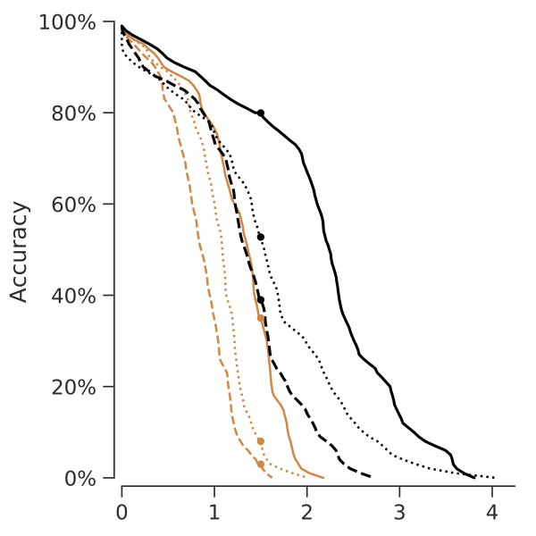
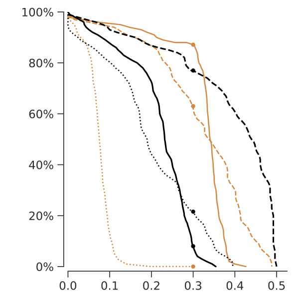
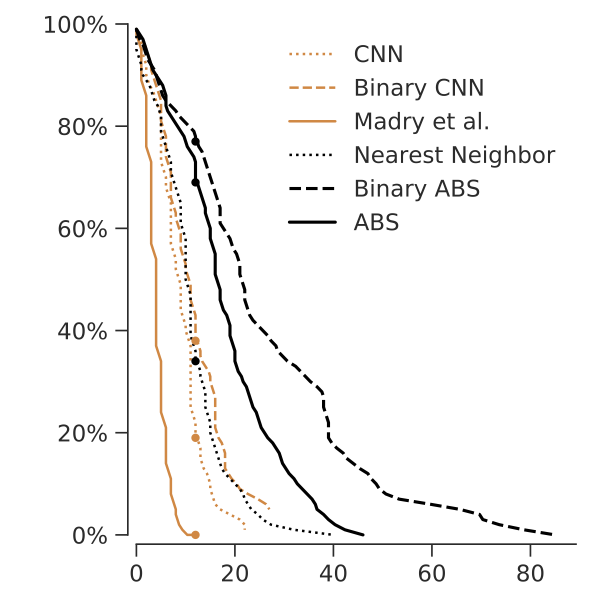

# Analysis by Synthesis

This is a complete reimplementation of our [Analysis by Synthesis](https://github.com/bethgelab/AnalysisBySynthesis) model.
The experiments in the paper were done with the original implementation. To the best of my knowledge, both are equivalent
and I tried to carefully reproduce all results but I cannot make any guarantees.

## Results from the paper

  
  
  

All data from the accuracy-distortion curves can be downloaded in raw form:

* [figures/L2_accuracy_distortion_curves.pickle](figures/L2_accuracy_distortion_curves.pickle)
* [figures/Linf_accuracy_distortion_curves.pickle](figures/Linf_accuracy_distortion_curves.pickle)
* [figures/L0_accuracy_distortion_curves.pickle](figures/L0_accuracy_distortion_curves.pickle)
